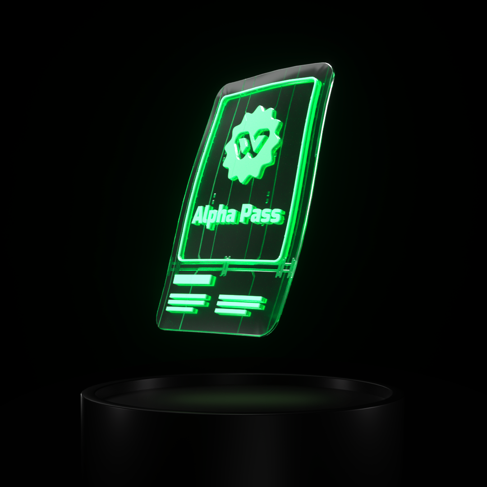
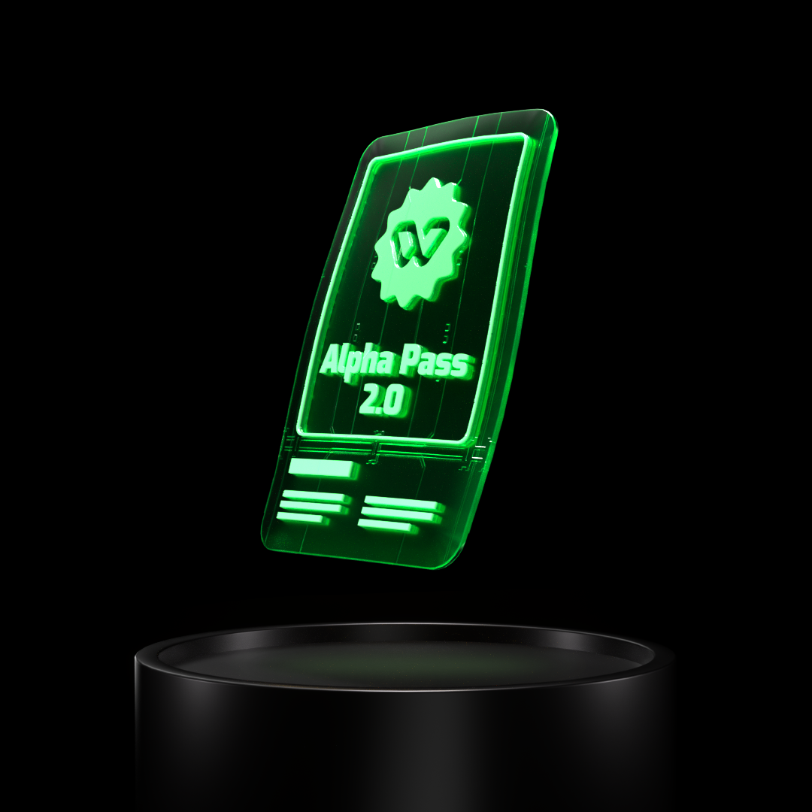
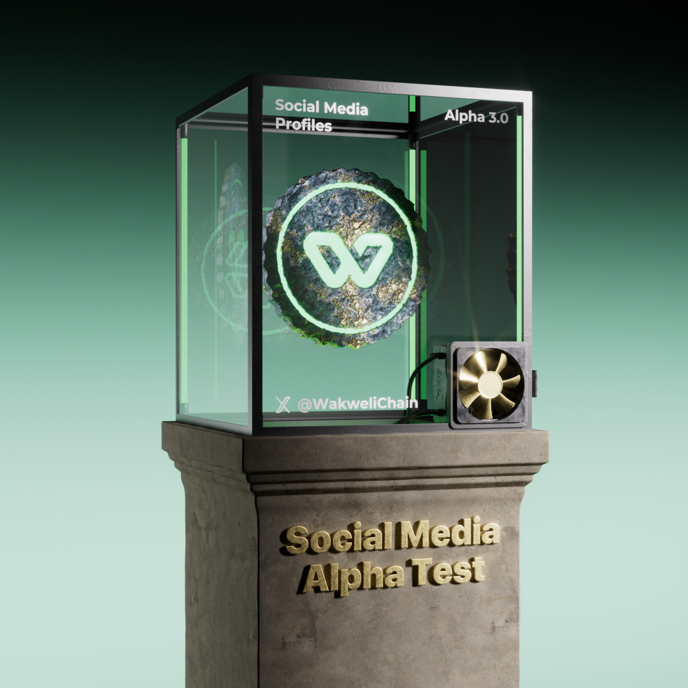

# Alpha

After concluding three successful Alpha phases, where a select group of testers validated NFT authenticity on OpenSea during the first two phases and certified profiles on X (formerly Twitter) in the third, Wakweli's cutting-edge certification technology has demonstrated its capabilities across digital platforms.

Explore our journey at [https://alpha.wakweli.com](https://alpha.wakweli.com).

___

## Alpha 1.0 - OpenSea NFT - Oct 2023

- Requests: 5,2K
- Certificates Issued: 2,7K
- Rewards: 618K $KIW (37K USD)

 

## Alpha 2.0 - OpenSea NFT - Apr-June 2024
- Requests: 52K
- Certificates Issued: 37K
- Challenges: 1,2K
- Rewards: 917K $KIW (55K USD)

 

## Alpha 3.0 Social Media Profile 3.0 - Oct 2024-Feb 2025

- Requests: 26K
- Certificates Issued: 24K
- Challenges: 2,3K
- Rewards: 800K $KIW (48K USD)

 
