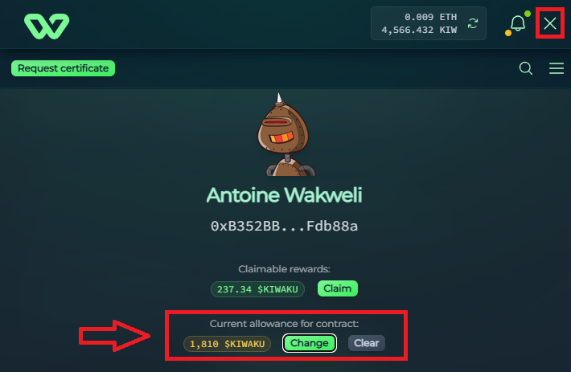

# $KIW Approval System

When interacting with the Wakweli protocol, users need to give the protocol permission to spend their $KIW tokens on their behalf. Normally, this requires two separate blockchain transactions:

* Approval transaction: authorize the protocol to use a specific amount of $KIW.
* Protocol transaction: perform the actual action (e.g., request a certificate, review, or challenge).

This can create friction, especially with the Base Account smart wallet, where multiple signing requests may trigger browser pop-up blockers.

The solution is to set a fixed global approval allowance ahead of time. This allows the protocol to use up to that approved amount of $KIW without requiring repeated approvals.

Benefits of Global Approval:

* One transaction instead of two: saves time and avoids double signing.
* No extra cost (less cost actually): the approval transaction is done only once instead of once per operation, saving some gas (& if you use the Base Account, this approval's ETH gas is also sponsored by Wakweli)
* Smooth user experience: fewer pop-up interruptions, especially for Base Account users.
* Reusable: once set, your allowance remains valid until it is fully consumed or revoked.

## How to Set a Global Approval

* Navigate to [https://canary.wakweli.com/](https://canary.wakweli.com/){:target="_blank"}
* Connect your wallet (Base Account or a regular EVM wallet).
* Once connected, open the user panel by clicking on the top-right button.
* Use the "Approve" interface in the left section to configure your desired approval (e.g. 1000 $KIW).
* Confirm the approval transaction.

💡 With the Base Account, this transaction is gas-sponsored, so it costs nothing to you.

You can now use the protocol normally:

* All future actions (certify, review, challenge) will use the approved $KIW without asking for new approvals each time.
* When the allowance runs out, you’ll be prompted to set a new one.

## Troubleshooting (Pop-up Issues)

If you don’t set a global approval, you may face pop-up blockers due to repeated approval + action flows. There are three workarounds:

* Enable pop-ups for wakweli.com in your browser.

* Retry the action (sometimes a single new action will be allowed through).

* Best solution: Set a global approval allowance to avoid repeated approvals entirely.

## Security Notes

* You remain in full control of your tokens: the protocol can never use more than your approved allowance.
* You can reset or revoke your allowance at any time.
* For peace of mind, many users choose to approve slightly more than they expect to use, instead of an unlimited amount.
