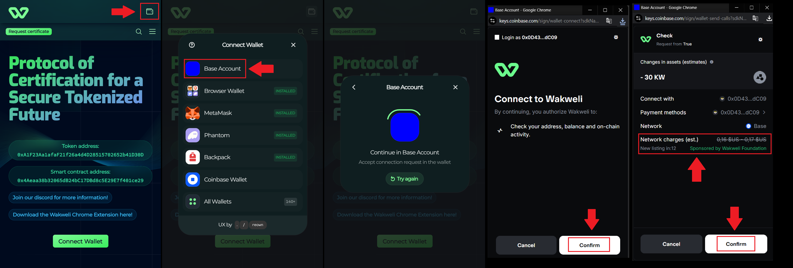

# Using Base Account Wallet with Wakweli

Wakweli now integrates with the Base Account wallet, a smart wallet powered by passkeys. This new login method simplifies onboarding and removes two common barriers for blockchain users:

* No seed phrase required: your wallet is secured with a passkey on your device, not a 12-word backup.
* No gas fees needed: the Wakweli Foundation and Base sponsor your transactions, so you can certify, review, and challenge without holding ETH.

&nbsp;&nbsp;&nbsp;&nbsp;&nbsp;
&nbsp;&nbsp;&nbsp;&nbsp;&nbsp;
&nbsp;&nbsp;&nbsp;&nbsp;&nbsp;
&nbsp;&nbsp;&nbsp;&nbsp;&nbsp;

This makes Wakweli accessible to everyone, including first-time users who don’t yet own crypto:

* Easiest wallet to use: Secure your wallet with a device passkey (biometric, Face ID, Touch ID, or OS-level credential).
* Smart wallet protection: Funds and actions are handled by a smart contract wallet on Base.
* Sponsored gas fees: A Sponsored Paymaster covers up to $0.50 in daily gas fees per user, enough for dozens of transactions at Base’s low fees.
* Free tokens to start: New Base Account users qualify [receive 60 $KIW from the Wakweli Foundation](faucet.md) to explore the Canary Mainnet.
* Instant onboarding: No exchange funding, no manual ETH bridging, no wallet setup complexity.

## When to Use Base Account

* New users exploring Wakweli without existing crypto.
* Community members who want a gasless experience.
* Anyone preferring passkey security over seed phrases.

If you already hold $KIW on Ethereum or Base in a traditional wallet (MetaMask, Coinbase Wallet), you can keep using those: Base Account is an alternative login option.

## Step 1: Create your Base Account

* Go to the Canary interface at [https://canary.wakweli.com/](https://canary.wakweli.com/){:target="_blank"}
* Click on the "Connect Wallet" button on the top right
* Select "Base Account"
* Click on "Create account" and type a name for your passkey (can be anything, this is for your personal use)
* Approve the passkey login prompt from your device:
    * On desktop: this uses your OS passkey manager (can be fingerprint, face recognition, password manager...)
    * On mobile: Face ID, Touch ID, or Android device credential.

Your Base Smart Wallet is now created.

## Step 2: Claim your free $KIW

New Base Account users qualify [receive 60 $KIW from the Wakweli Foundation](faucet.md) to explore the Canary Mainnet.

These tokens let you certify, review, and challenge directly on the Canary Mainnet.

## Step 3: Enjoy gasless transactions

Every transaction (certification, review, challenge) normally requires gas.

With the Sponsored Paymaster feature, the Wakweli Foundation and Base now cover your fees.

At Base’s ~$0.01 fee per transaction, the $0.50/day cap covers dozens of daily actions.
