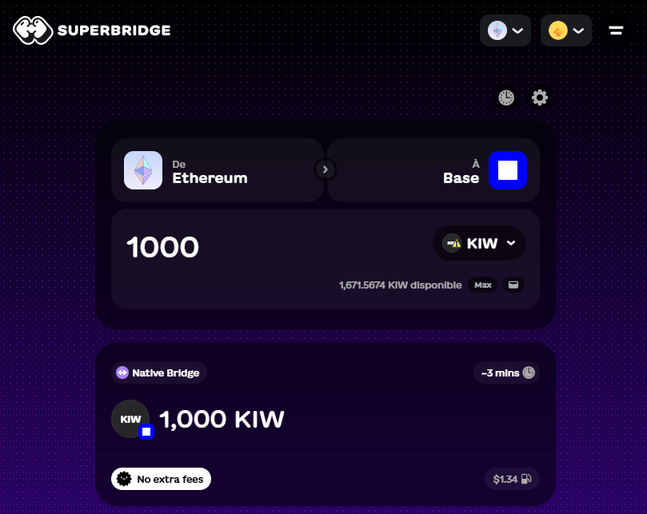
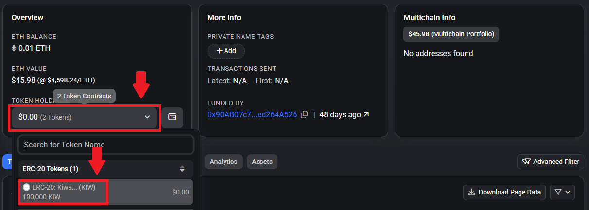

# Bridge $WAKU on Base

To participate in Wakweli Mainnet, users need $WAKU on Base. If you hold $WAKU on Ethereum, you can bridge them to Base to use them on the Mainnet. This page explains how to do it safely.

## Step 1: Locate your wallet with $WAKU on Ethereum

Users from Private Sale / Akpha Tests / Giveaways have receieved $WAKU on Ethereum from earlier phases through vesting on [Sablier (access your streams here)](https://app.sablier.com/vesting){:target="_blank"}.
It's also possible to buy $WAKU from Decentralized Exchanges on Ethereum or Base (links on [Wakweli Website](https://wakweli.com){:target="_blank"})

## Step 2: Connect to Superbridge to bridge

Open [Superbridge (https://superbridge.app/)](https://superbridge.app/?fromChainId=1&toChainId=8453&tokenAddress=0x4d6b62861d1f60e864fd7c913f840d70b2713d0c){:target="_blank"}

This link should already load the custom $WAKU smart contract addresses from Ethereum and Base. If it is not the case, you can manually import them using Smart Contract addresses below (use the Base Smart Contract address in search bar).

⚠️ Always verify the token contract before bridging:

* Base WAKU Contract:
    * 0x4d6b62861d1f60e864fd7c913f840d70b2713d0c
    * Link to explorer: [basescan.org/address/0x4d6b62861d1f60e864fd7c913f840d70b2713d0c](https://basescan.org/address/0x4d6b62861d1f60e864fd7c913f840d70b2713d0c){:target="_blank"}
    * Ethereum WAKU Contract:
    * 0x93F014930d90A0D0f17B079f71D9aA5f3ADf2b27
    * Link to explorer: [etherscan.io/address/0x93F014930d90A0D0f17B079f71D9aA5f3ADf2b27](https://etherscan.io/address/0x93F014930d90A0D0f17B079f71D9aA5f3ADf2b27){:target="_blank"}

Then follow these steps:

* Connect your wallet (MetaMask, Coinbase Wallet, etc.)
* Select $WAKU (Ethereum) as the token to send.
* Choose Base as the destination.
* Enter the amount you want to bridge.
* Confirm the transaction in your wallet.

Superbridge requires no signup and is the recommended method.

## Step 3: Wait for confirmation

The bridging process may take a few minutes.

Once complete, check your wallet on Base network to confirm your $WAKU balance (you may need to manually import the Token on Base in your wallet using the Smart Contract address above)

## Step 4: Explore the Canary Mainnet

With $WAKU on Base, you can now interact with the protocol:
🌐 [https://mainnet.wakweli.com/](https://mainnet.wakweli.com/){:target="_blank"}

If you encounter issues: Join the Discord and ask in ⁠[#tester-chat](https://discord.com/channels/883518761947263046/1082698265029513216){:target="_blank"}

## Troubleshooting

* Didn’t receive tokens? Double-check the contract address and ensure you bridged to the Base network.
* You can also directly check your account balance on [BaseScan](https://basescan.org/){:target="_blank"} as the token may not automatically be displayed in your wallet.
* No WAKU to bridge? Get some from the [faucet](faucet.md) of request some on Discord via the ticket system.
* Transaction stuck? Check Etherscan and BaseScan for status updates.