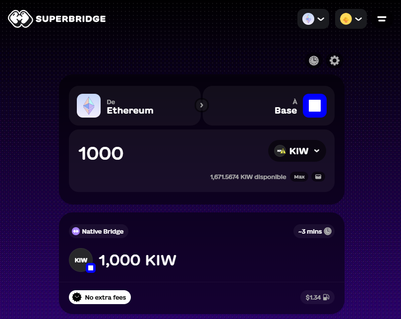
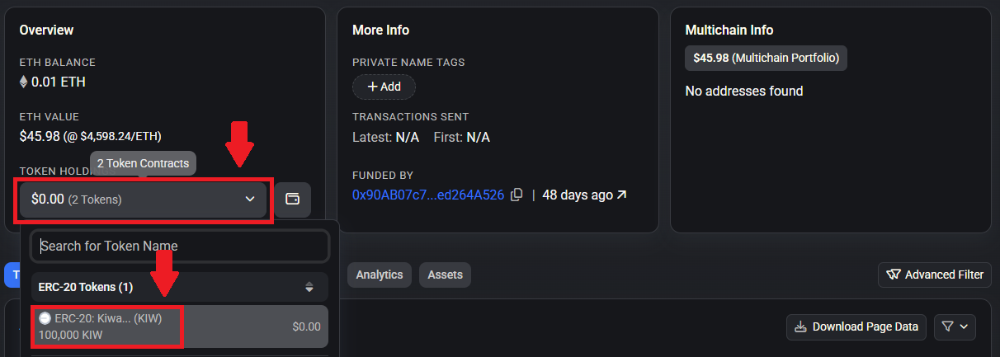

# Bridge $KIW on Base

To participate in the Wakweli Canary Mainnet, users need $KIW on Base. If you hold $KIWAKU on Ethereum, you can bridge them to Base to use them on the [Canary Mainnet](canary.md). This page explains how to do it safely.

## Step 1: Locate your wallet with $KIW on Ethereum

Users from Private Sale / Akpha Tests / Giveaways  should already hold $KIWAKU (KIW) on Ethereum from earlier phases.

## Step 2: Connect to Superbridge to bridge

Open [Superbridge (https://superbridge.app/)](https://superbridge.app/?fromChainId=1&toChainId=8453&tokenAddress=0x5ff8a0a0937F8AbB4B7a50a6c50A24B07453fAD1){:target="_blank"}

This link should already load the custom $KIW smart contract addresses from Ethereum and Base. If it is not the case, you can manually import them using Smart Contract addresses below.

⚠️ Always verify the token contract before bridging:

* Ethereum KIW Contract:
    * 0x5ff8a0a0937F8AbB4B7a50a6c50A24B07453fAD1
    * Link to explorer: [etherscan.io/address/0x5ff8a0a0937f8abb4b7a50a6c50a24b07453fad1](https://etherscan.io/address/0x5ff8a0a0937f8abb4b7a50a6c50a24b07453fad1){:target="_blank"}
* Base KIW Contract:
    * 0xA1F23Aa1afaF21f26a4d4D28515702652b41D30D
    * Link to explorer: [basescan.org/address/0xa1f23aa1afaf21f26a4d4d28515702652b41d30d](https://basescan.org/address/0xa1f23aa1afaf21f26a4d4d28515702652b41d30d){:target="_blank"}

Then follow these steps:

* Connect your wallet (MetaMask, Coinbase Wallet, etc.)
* Select $KIWAKU (Ethereum) as the token to send.
* Choose Base as the destination.
* Enter the amount you want to bridge.
* Confirm the transaction in your wallet.

Superbridge requires no signup and is the recommended method.

## Step 3: Wait for confirmation

The bridging process may take a few minutes.

Once complete, check your wallet on Base network to confirm your $KIW balance (you may need to manually import the Token on Base in your wallet using the Smart Contract address above)

## Step 4: Explore the Canary Mainnet

With $KIW on Base, you can now interact with the protocol:
🌐 [https://canary.wakweli.com/](https://canary.wakweli.com/){:target="_blank"}

If you encounter issues: Join the Discord and ask in ⁠[#tester-chat](https://discord.com/channels/883518761947263046/1082698265029513216){:target="_blank"}

## Troubleshooting

* Didn’t receive tokens? Double-check the contract address and ensure you bridged to the Base network.
* You can also directly check your account balance on [BaseScan](https://basescan.org/){:target="_blank"} as the token may not automatically be displayed in your wallet.
* No KIW to bridge? Get some from the [faucet](faucet.md) of request some on Discord via the ticket system.
* Transaction stuck? Check Etherscan and BaseScan for status updates.