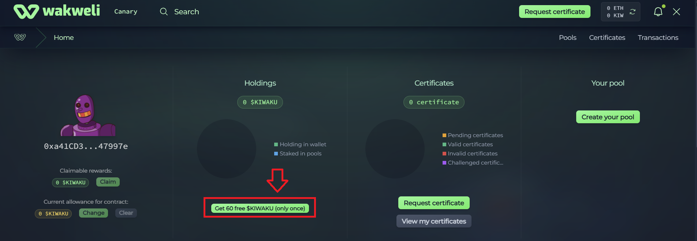

# Get free $KIW from the faucet

To help new users onboard quickly, Wakweli provides a free 60 $KIW faucet directly on the Base network. This faucet is accessible from the [main interface](https://canary.wakweli.com/){:target="_blank"} when you have a balance of 0 $KIW in your wallet.

And if you use to the [Base Account smart wallet](baseaccount.md), so you can start using the protocol immediately: no seed phrase, no gas fees, no external funding.

What you get:

* 60 $KIW credited to your wallet (gas sponsored if you use the [Base Account smart wallet](baseaccount.md))
* Enough to request, review, and challenge certificates on the Canary Mainnet.
* Refills are not automatic: the faucet is a one-time grant per user to kickstart your journey.

## How to Claim

* Go to [https://canary.wakweli.com/](https://canary.wakweli.com/){:target="_blank"}
* Click the "Connect Wallet" button on the top right
* Select your prefferred wallet (if you don't have a wallet yet, choose [Base Account](baseaccount.md))
* Once connected, open the user panel by clicking on the top-right button
* Click on the "Get 60 free $KIWAKU" button in the "Holdings" section
* Comfirm the transaction in your wallet (no gas needed with a Base Account wallet)
* The faucet credits your wallet with 60 $KIW instantly.

Check your wallet balance on the interface to confirm.

## Start using the protocol

Use your 60 $KIW to:

* Request certificates
* Review certificates
* Challenge doubtful submissions

## Why 60 $KIW?

* Designed as an onboarding allocation.
* Ensures users can explore Wakweli features without worrying about balances.
* Combined with Sponsored Paymaster gas credits, it means a completely free first experience.

### Notes

Faucet is only distributed once per Base Account wallet.

If you need more tokens later, you can:

* Earn them through protocol activity.
* Bridge additional $KIW from Ethereum.
* Contact us on Discord (via the #get-ticket channel)
