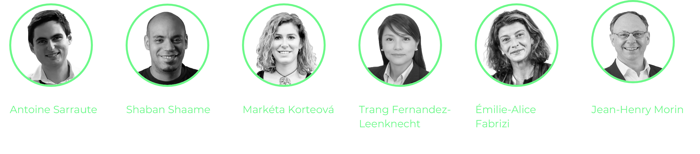

# Wakweli Foundation

The Wakweli Foundation was established in **September 2024** in Geneva (CH) to foster trust in the digital world. 

As a **Swiss Foundation**, it develops tools to verify authenticity across products, services, and data. Guided by values of authenticity, integrity, and fairness, the Foundation supports global initiatives in areas such as consumer protection, investor safety & human rights defense while investing in knowledge, community, and technological growth to build a sustainable digital economy.

## The Foundation Board

- [Antoine Sarraute](https://www.linkedin.com/in/antoine-sarraute/) - Executive Director - 15yrs in innovation & decentralized tech
- [Shaban Shaame](https://www.linkedin.com/in/shaban-shaame/) - President - Inventor of 1st Bitcoin gaming NFTs 10 years ago
- [Markéta Korteová](https://www.linkedin.com/in/marketakorteova/) - Vice-President - Piloted a 900 BTC ICO in 2015
- [Trang Fernandez-Leenknecht](https://www.linkedin.com/in/trangfernandezleenknecht/) - Board Member - Expert Tax Lawyer & Wealth Manager
- [Émilie-Alice Fabrizi](https://www.linkedin.com/in/emilie-alice-fabrizi-3046751a/) - Board Member - Pillar of Geneva’s web3 community for impact
- [Jean-Henry Morin](https://www.linkedin.com/in/jhmorin/) - Board Member - University Professor expert in digital responsibility
