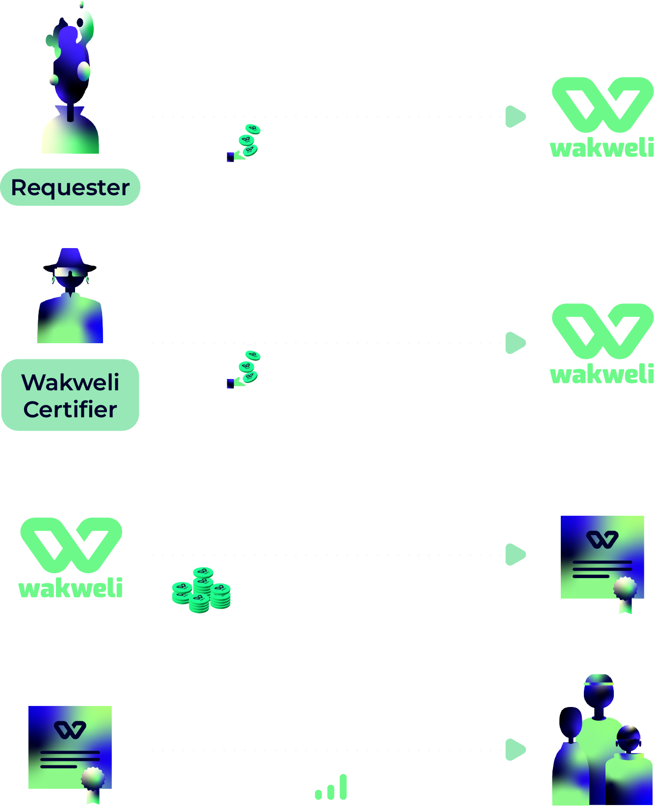

# The Technology Behind Wakweli

With Wakweli, we are building a powerful and innovative technological foundation to ensure trust, transparency, and authenticity in the digital world. Here’s how it works:

- **A Scalable and Decentralized Blockchain Solution**
    - Our project is powered by a robust smart contract engine deployed on a cost-efficient EVM Layer-2 Blockchain. (Base Blockchain (Layer-2))
    - This ensures scalability and efficiency, allowing for high performance without compromising Wakweli's commitment to decentralization.
- **Proof-of-Democracy (PoD) Consensus Algorithm**
    - At the heart of Wakweli is the Proof-of-Democracy (PoD) consensus, a unique mechanism designed to ensure authenticity through community-driven validation.

 

___

## How It Works

### 1. Certificate Requests

- Any holder of **$WAKU tokens** can initiate a **certificate request** to verify the authenticity of a digital information ((e.g., social media profile, URL or news article)
- To submit a request, users must stake **$WAKU tokens** - the more tokens staked, the higher the trust level of the certificate.

### 2. Validation by Certifiers

- Certifiers, elected by the Wakweli community, review certificate requests.
- They must also **stake the same amount of $WAKU tokens** as the requester, with 50% of the staked amount provided by their elector.
- Certifiers analyze the information carefully and decide whether to validate or reject the certificate.

Once a certificate is generated, a Wakweli tick mark  will appear through the Wakweli Chrome Extension. A green tick mark  indicates a legitimate certificate, while a red tick mark  highlights a potential scam, helping users navigate the digital ecosystem with confidence.

> You can download the Chrome Extension here: [Wakweli on Chrome Web Store](https://chromewebstore.google.com/detail/wakweli/bhlmfakmgikajjenjhafifmdkkjchcli)

### 3. Rewards for Certificate Generation

Once a certificate is generated (whether it’s validated or rejected), rewards in $WAKU tokens are distributed over time to everyone involved:

- Electors (who elected the certifiers) receive 30% of the total staked amount.
- Certifiers (who reviewed the certificate request) receive 70% of the total staked amount.

> Note: 3% of each share is allocated to the Wakweli treasury.

### 4. Community Challenge for Equilibrium

- Wakweli’s system uses the certificate’s reward pool as a bounty, motivating the community to quickly challenge any certificate they think might be inaccurate before the rewards are given out.
- If a challenge is successful and a certificate is proven false, the rewards linked to the certificate are redirected to the parties who provided the correct verdict.
- This creates a self-regulating system that encourages participants to always seek and uphold the truth.

___

## What Makes Wakweli Unique

By combining a scalable blockchain framework, the **Proof-of-Democracy (PoD)** consensus, and a token-incentivized validation process, Wakweli ensures that authenticity is community-driven, fair, and decentralized. This innovative approach creates a balanced ecosystem where trust is rewarded, and dishonesty is penalized.
Together, we are building a **trusted and fraud-free digital world**!
