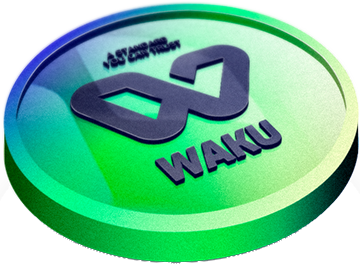
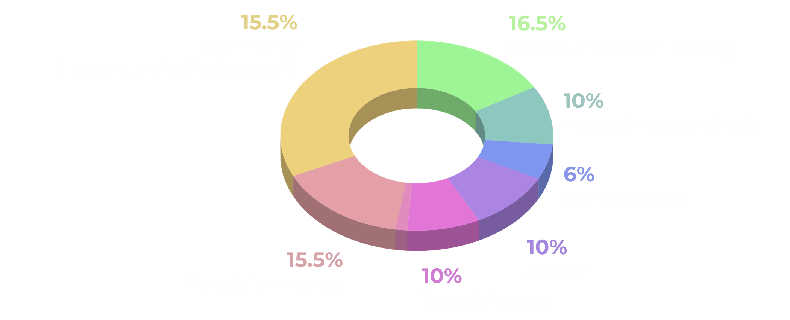
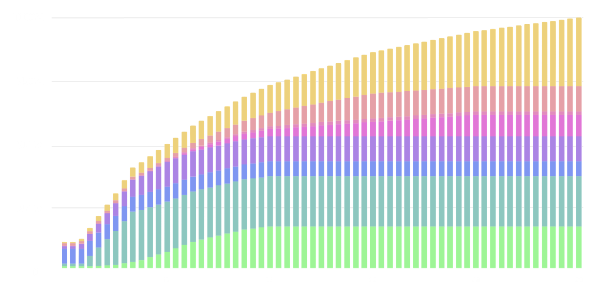

# $WAKU

## The Unit of Trust

- Token: $WAKU
- Blockchain: Ethereum
- Initial supply: 1 000 000 000
- Protocol: Proof of Democracy (PoD)

The token supply will be hosted on Ethereum, with a percentage sent to the Base blockchain to support protocol operations.

   
  
| | Locked + Vesting Period (linear, mth) | % Alloc Total Supply | Total # of Tokens | % Unlocked at Genesis (TGE) | # of tokens at Genesis | # of tokens to be released |
| ------ | ------ | ------ | ------ | ------ | ------ | ------ |
| [SOLDOUT] Private Sale - Protocol Incubation | 3~12  + 9~12 | 16,5% | 165M | 3,3~5% | ~6.6M | ~158M |
| [OPEN]  Private Sale - Protocol Pre-Launch | 2 + 6 | 10% | 100M | 5% | 5M | 95M |
| Listing, Liquidity, Launchpool | 0 + 0 | 6% | 60M | 100% | 60M | - |
| Airdrop | 1 + 11 | 10% | 100M | 10% | 10M | 90M |
| Team | 12 + 36 | 8,6% | 86M | 0,0% | - | 86M |
| Advisors & Partners | 6 + 24 | 1,4% | 14M | 10,0% | 1.4M | 12.6M |
| Foundation Reserves | 12 + 24 | 15,5% | 155M | 10% | 15.5M | 139.5M |
| Treasury, Marketing & Community Growth | 1 + 59 | 32% | 320M | 2% | 6.4M | 272M |
| **Total** | | **100,0%** | **1B** | **10.49%** | **~105M** | **~895M** |
 
   

- Pre-Token: $KIWAKU
- Blockchain: Ethereum
- Initial supply: 1 000 000 000
- Smart Contract: [0x5ff8a0a0937F8AbB4B7a50a6c50A24B07453fAD1](https://etherscan.io/address/0x5ff8a0a0937F8AbB4B7a50a6c50A24B07453fAD1){:target="_blank"}

$WAKU is essential to the protocol's operations, forming the foundation of the PoD. Ownership of $WAKU is necessary for participation, and contributors are rewarded with $WAKU for fostering trust and collaboration.

In addition, $WAKU will be used to vote on proposals governing the Wakweli Foundation.

## Business Model

**Revenue Sharing**: The protocol operates sustainably by taking 3% of the staked amount for each generated certificate. Once a certificate is created, rewards are distributed to contributors — 70% to Certifiers and 30% to Electors. From these rewards, 3% is directed back to the Wakweli treasury, ensuring long-term growth, development, and the continuous improvement of the protocol.

 